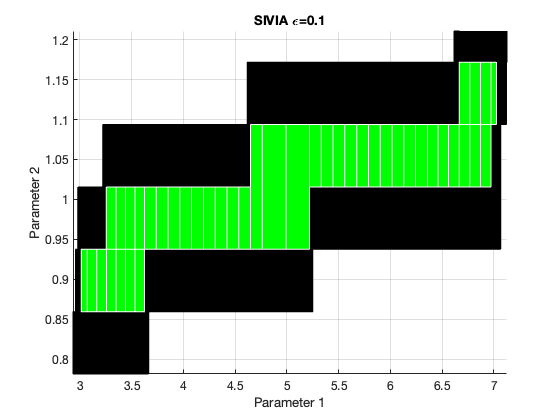
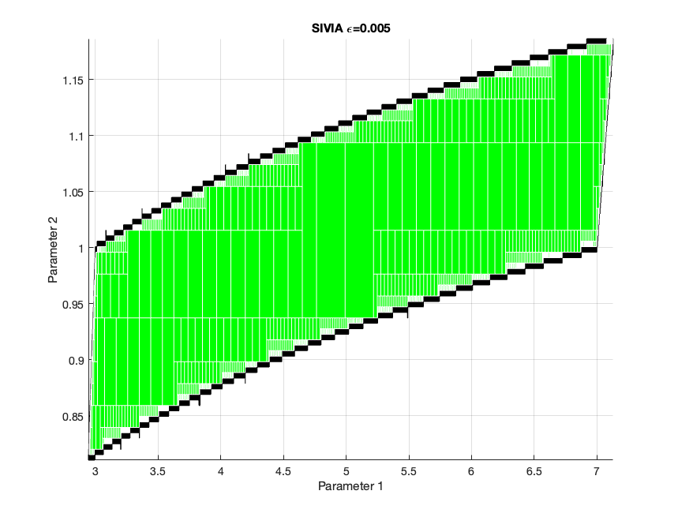

Set Inversion
=============
*Set inversion* is the problem of finding the preimage ```X``` of a set ```Y``` by some function ```f```: 
```X=f^-1(Y)```.

This repo contains C++ code implementing a basic *Set Inversion via Interval Analysis* algorithm. The C++ code depends 
on ```boost::numeric::interval``` to work. I plot the solutions returned by the algorithm in a MATLAB script to validate 
the solution visually.




*Figure 1:* The figures above depicts the solutions returned by the SIVIA algorithm to an example parameter estimation
problem. The green region contains ordered pairs ```(x1, x2)``` representing the system parameters to be estimated, 
which satisfy the known measurement tolerances. The first graph shows the SIVIA solution with an estimation bound of 
```0.1``` and the second graph shows the solution to the same problem with an estimation bound of ```0.005```. This 
demonstrates that the black region contains candidate solutions, but does not only contain candidate solutions.

Parameter Estimation
--------------------
It is possible to formulate *parameter estimation* problems as set inversion problems. For example, suppose we have a 
dynamical system that outputs ```y = g(x,u,t;p)```, where ```y``` represents the measurement, ```g(...)``` represents 
the measurement model, ```x``` represents the system state, ```u``` represents the control input, ```t``` represents the 
time, and ```p``` represents the system parameters. The goal of parameter estimation in this context might be to 
estimate the system parameters given a history of measurements corrupted by noise, the time, and estimates of the system
state and control input. The solution to this particular problem is ```(5, 1)```

Obviously, there are many ways of approaching this problem. One such way is set inversion.

Contractors
-----------
Contractors are the key to making the SIVIA approach efficient.

Contractors are functions ```C: IR^n -> IR^n```, where ```IR``` represents the interval real number space. 

They have two properties: (1) so-called "contractance" property ```C([x]) &#x2282; [x]```, and (2) so-called 
"completeness" property ```C([x]) &#x2229; X = [x] &#x2229; X```.

The details of constructing contractors is not hard to understand, but involves many steps. So, I will not try to spell
out how contractors are constructed here. 

Takeaways
---------
I'm no expert on this subject.

SIVIA is a cool way of doing parameter estimation, but its practical usefulness limited by: (1) its slowness, (2) its 
requirement that the measured values be intervals.

### Pros
1. Algorithm is simple
2. Algorithm is sound
   - the algorithm returns bounds on ```X```, which never don't contain true ```X```.

### Cons
1. Algorithm is slow
    - Exponential in the number of parameters to be estimated. Gets very slow as ```epsilon < 0.0001``` in my
      (admittedly limited) experience.
2. Algorithm is not complete (but can get arbitrarily close to being complete as ```epsilon -> 0```)
    - Algorithm returns an upper- and lower-bound on ```X```. In that sense, the algorithm is NOT sound, because the 
      solution, which the algorithm returns by its very nature contains solutions that are not the "true" X. However, it
      is theoretically possible to tighten the lower- and upper-bounds of ```X``` to be arbitrarily small. Practically, 
      you might run out of memory trying to achieve arbitrarily small bounds.

