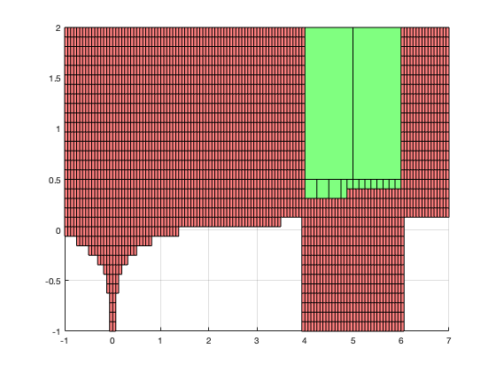

Set Inversion
=============
*Set inversion* is the problem of finding the preimage ```X``` of a set ```Y``` by some function ```f```: 
```X=f^-1(Y)```.

This repo contains C++ code implementing a basic "Set Inversion via Interval Analysis" algorithm. The C++ code depends 
on ```boost::numeric::interval``` to work. I plot the solutions returned by the algorithm in a MATLAB script to validate 
the solution visually.



*Figure 1:* The figure above depicts the solution returned by the SIVIA algorithm to an example problem. The green 
region represents the region of parameter-space, which contains the true parameters. The red region represents the 
region of the parameter-space, which does not contain the true parameters. The true parameters are (5, 1).    

Parameter Estimation
--------------------
It is possible to formulate *parameter estimation* problems as set inversion problems. For example, suppose we have a 
dynamical system that outputs ```y = g(x,u,t; p)```, where ```y``` represents the measurement, ```g(...)``` represents 
the measurement model, ```x``` represents the system state, ```u``` represents the control input, ```t``` represents the 
time, and ```p``` represents the system parameters. The goal of parameter estimation in this context might be to 
estimate the system parameters given a history of measurements corrupted by noise, the time, and estimates of the system
state and control input. 

Obviously, there are many ways of approaching this problem. One such way is set inversion.

### Questions
1. What is the effect of the measurements tolerances on ```X-``` region?
2. What is the effect of the number of measurements on the ```X-``` region?
3. What is the effect of the size of ```epsilon``` on the ```X-``` region?
4. What is the effect of the size of ```epsilon``` on the convergence time?
5. What is the effect of the number of parameters on convergence time?
6. Can we implement the so-called SIVIA-Contractors algorithm?

Contractors
-----------
- Use the same algorithm as before, but rather than bisecting, bisect a contracted quantity.
- contractors use structure of dynamics along with history of measurements close in on better guess...
- need to refactor to clean some stuff up


Pros and Cons of this Approach
------------------------------
My takeaways (I'm not an expert in this area).

### Pros
1. Algorithm is simple
2. Algorithm is sound
   - the algorithm returns bounds on ```X```, which never don't contain true ```X``` so long as algorithm is seeded with
     good initial guess, which is trivial to accomplish.

### Cons
1. Algorithm is slow
    - Exponential in the number of parameters to be estimated. Gets very slow as epsilon gets small.
2. Algorithm is not complete (but can get arbitrarily close to only containing true solution)
    - Algorithm returns an upper- and lower-bound on ```X```. In that sense, the algorithm is NOT sound, because the 
      solution, which the algorithm returns by its very nature contains solutions that are not the "true" X. However, it
      is theoretically possible to tighten the lower- and upper-bounds of ```X``` to be arbitrarily small. Practically, 
      you might run out of memory trying to achieve arbitrarily small bounds.