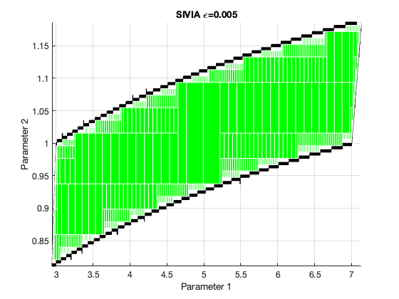

Set Inversion
=============
*Set inversion* is the problem of finding the preimage ```X``` of a set ```Y``` by some function ```f```: 
```X=f^-1(Y)```.

This repo contains C++ code implementing a basic *Set Inversion via Interval Analysis* (SIVIA) algorithm. The C++ code
depends on ```boost::numeric::interval``` to work. I plot the solutions returned by the algorithm in a MATLAB script to 
validate the solution visually.




*Figure 1:* The figures above depict the solutions returned by the SIVIA algorithm to an example parameter estimation
problem. The green region contains ordered pairs ```(x1, x2)``` representing the system parameters to be estimated, 
which satisfy the known measurement tolerances. The first graph shows the SIVIA solution with an estimation bound of 
```0.1``` and the second graph shows the solution to the same problem with an estimation bound of ```0.005```. This 
demonstrates that the black region contains candidate solutions, but also contains ordered pairs that are not solutions.
The solution to this particular problem is ```(5, 1)```

Parameter Estimation
--------------------
It is possible to formulate *parameter estimation* problems as set inversion problems. For example, suppose we have a 
dynamical system that outputs ```y = g(x,u,t;p)```, where ```y``` represents the measurement, ```g(...)``` represents 
the measurement model, ```x``` represents the system state, ```u``` represents the control input, ```t``` represents the 
time, and ```p``` represents the system parameters. The goal of parameter estimation in this context might be to 
estimate the system parameters given a history of measurements bounded by some error, the time, and estimates of the
system state and control input. 

Obviously, there are many ways of approaching this problem. One such way is set inversion.

At a high-level, we make a guess in the form of an *interval* for each unknown parameter. We check to see if those 
guesses correspond with what we measured. 

Contractors
-----------
Contractors are the key to making the SIVIA approach efficient.

Contractors are functions ```C: IR^n -> IR^n```, where ```IR``` represents the interval real number space. 

They have two properties: (1) so-called "contractance" property ```C([x]) &sub; [x]```, and (2) so-called 
"completeness" property ```C([x]) &cap; X = [x] &cap; X```.

The details of constructing contractors is not hard to understand, but involves many steps. So, I will not try to spell
out how contractors are constructed here. The source code has some examples.

Takeaways
---------
I'm not an expert on this subject.

SIVIA is a cool way of doing parameter estimation, but its practical usefulness is limited by: (1) its slowness, (2) its 
requirement that the measured values be intervals. It offers a very cool way of visualizing the solution in 
parameter-space though.

### Pros
1. Algorithm is simple
2. Algorithm is complete
   - the algorithm returns bounds on ```X```, which never don't contain true ```X```.

### Cons
1. Algorithm is slow
    - Exponential in the number of parameters to be estimated. Gets very slow as ```epsilon < 0.0001``` in my 
      implementation.
2. Algorithm is not sound (but can get arbitrarily close to being sound as ```epsilon -> 0```)
    - Algorithm returns an upper- and lower-bound on ```X```. In that sense, the algorithm is NOT sound, because the 
      solution, which the algorithm returns, contains solutions that are not the "true" X. However, it is possible to
      tighten the lower- and upper-bounds of ```X``` to be arbitrarily small.

